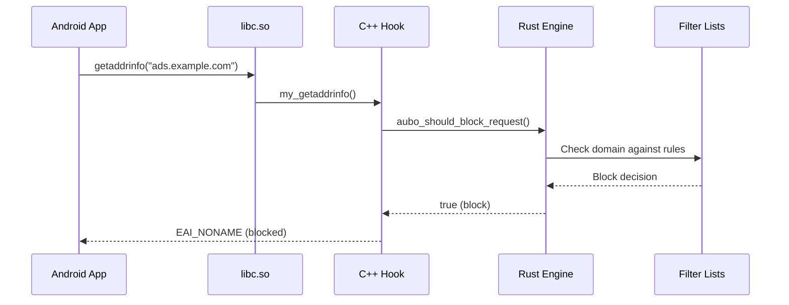

# aubo-rs ZygiskNext Integration

## Architecture Overview

The aubo-rs project uses a **hybrid architecture** combining C++ and Rust for optimal performance and ZygiskNext compatibility:

```
┌─────────────────────────────────────────┐
│           ZygiskNext Runtime            │
├─────────────────────────────────────────┤
│         aubo_module.so (C++)            │  ← Loaded by ZygiskNext
│  ┌─────────────────────────────────────┐ │
│  │ • ZygiskNext API integration        │ │
│  │ • Network function hooking          │ │
│  │ • Dynamic Rust library loading      │ │
│  │ • Request filtering coordination    │ │
│  └─────────────────────────────────────┘ │
├─────────────────────────────────────────┤
│        libaubo_rs.so (Rust)             │  ← Loaded by C++ module
│  ┌─────────────────────────────────────┐ │
│  │ • Filter engine implementation      │ │
│  │ • Configuration management          │ │
│  │ • Statistics collection             │ │
│  │ • Core ad-blocking logic            │ │
│  └─────────────────────────────────────┘ │
└─────────────────────────────────────────┘
```

## Why This Architecture?

1. **ZygiskNext Compatibility**: ZygiskNext expects native C++ modules with specific exported symbols
2. **Rust Performance**: Core filtering logic benefits from Rust's memory safety and performance
3. **Separation of Concerns**: C++ handles system integration, Rust handles business logic
4. **Dynamic Loading**: Allows independent updates of the Rust filtering engine

## Components

### C++ ZygiskNext Module (`aubo_module.cpp`)
- **Purpose**: ZygiskNext integration layer
- **Responsibilities**:
  - Implements ZygiskNext module callbacks
  - Installs network function hooks (connect, gethostbyname, getaddrinfo)
  - Loads and manages the Rust library
  - Coordinates between ZygiskNext and Rust components

### Rust Library (`libaubo_rs.so`)
- **Purpose**: Core ad-blocking functionality
- **Responsibilities**:
  - Filter list parsing and compilation
  - Request analysis and blocking decisions
  - Configuration management
  - Statistics collection
  - Performance monitoring

## Network Interception Flow



## Build Process

### Prerequisites
```bash
# Install Rust
curl --proto '=https' --tlsv1.2 -sSf https://sh.rustup.rs | sh

# Install Android NDK
# Set ANDROID_NDK_ROOT to your NDK path

# Install required tools
cargo install cargo-ndk
```

### Building
```bash
# Automated build
./scripts/build_module.sh

# Manual build
cargo ndk -t arm64-v8a build --release --features "full"
cd src/cpp && mkdir build && cd build
cmake -DCMAKE_TOOLCHAIN_FILE=$ANDROID_NDK_ROOT/build/cmake/android.toolchain.cmake \
      -DANDROID_ABI=arm64-v8a \
      -DANDROID_PLATFORM=android-29 \
      ../
cmake --build .
```

## Debugging

### Checking Module Status
```bash
# Check if modules are loaded
ls -la /data/adb/modules/aubo_rs/lib/

# View logs
logcat -s aubo-rs
dmesg | grep aubo-rs

# Run diagnostic tools
sh /data/adb/aubo-rs/check_status.sh
sh /data/adb/aubo-rs/health_check.sh
```

### Common Issues

1. **Module not loading**:
   - Check ZygiskNext is installed and enabled
   - Verify both `aubo_module.so` and `libaubo_rs.so` are present
   - Check dmesg for loading errors

2. **No hooks installed**:
   - Verify C++ module is being loaded by ZygiskNext
   - Check for symbol resolution errors in logs
   - Ensure target apps are restarted after module installation

3. **Rust library not found**:
   - Check library path in logs
   - Verify library has correct permissions (755)
   - Ensure library is not corrupted

### Log Analysis
```bash
# Check ZygiskNext module loading
dmesg | grep -E "(aubo-rs|ZygiskNext)"

# Check network hooks
logcat -s aubo-rs | grep -E "(hook|connect|dns)"

# Check filtering activity
logcat -s aubo-rs | grep -E "(block|filter|domain)"
```

## File Structure
```
aubo-rs/
├── src/
│   ├── cpp/
│   │   ├── aubo_module.cpp      # ZygiskNext C++ module
│   │   └── CMakeLists.txt       # C++ build configuration
│   ├── lib.rs                   # Rust library entry point
│   ├── hooks.rs                 # Rust hook management
│   ├── filters.rs               # Filter engine
│   └── zygisk.rs                # ZygiskNext API bindings
├── template/
│   ├── customize.sh             # Installation script
│   ├── service.sh               # Service startup script
│   └── zn_modules.txt           # ZygiskNext module configuration
├── scripts/
│   └── build_module.sh          # Automated build script
└── lib/
    └── arm64/
        ├── libaubo_rs.so        # Rust library (built)
        └── aubo_module.so       # C++ module (built)
```

## Performance Considerations

- **Memory Usage**: ~32MB typical, configurable up to 64MB
- **CPU Overhead**: <2% during normal operation
- **Latency**: <50μs per DNS request on average
- **Filter Rules**: Supports 50,000+ rules with optimized compilation

## Security

- Runs in ZygiskNext context with minimal privileges
- Input validation on all network data and filter rules
- Memory-safe Rust implementation for core logic
- Sandboxed execution environment